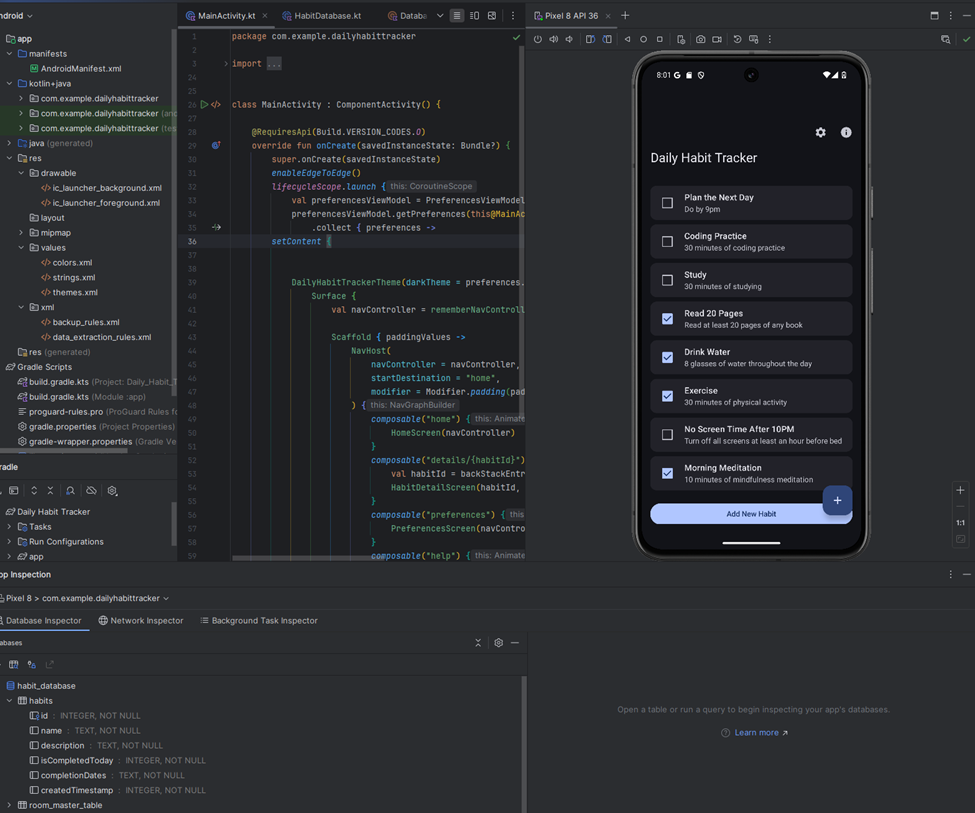
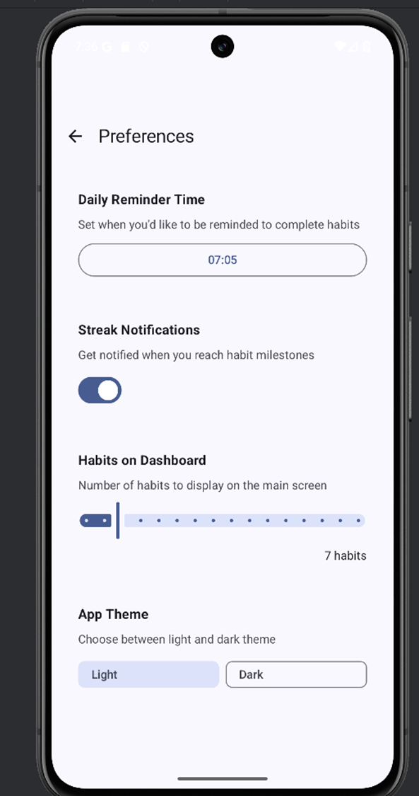
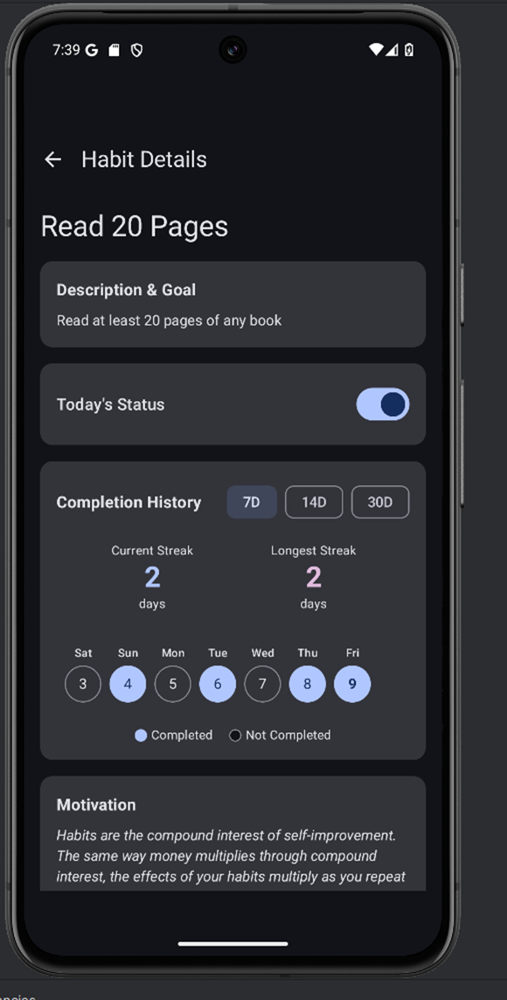
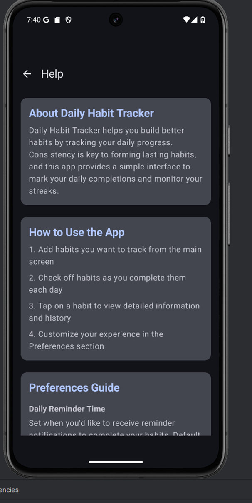
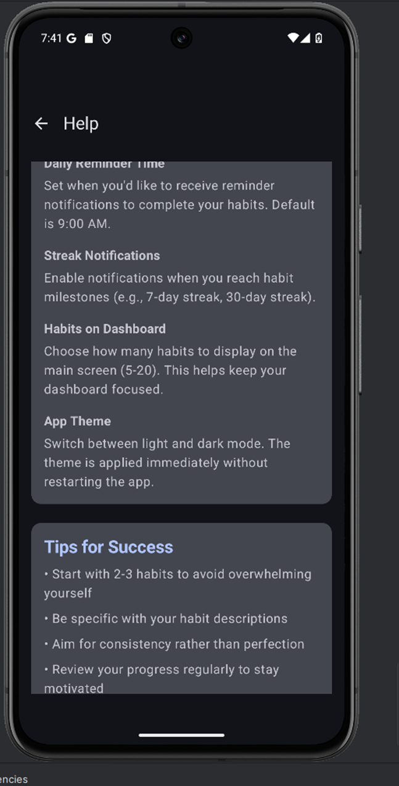
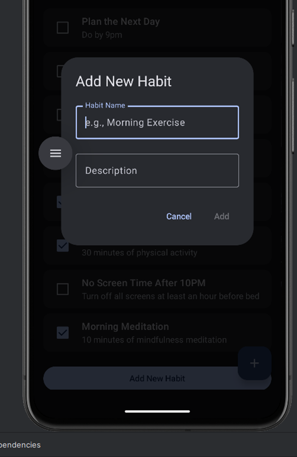

# Daily Habit Tracker

## App Description
A simple Android app to help users build and track daily habits. Developed as part of a mobile development course.

## Features
- Track multiple habits
- Mark daily habit completion
- Persistent habit storage
- Customizable preferences
- Motivational quotes
- Light/Dark mode
- Habit completion history
- Streaks

## Technical Details
- Language: Kotlin
- Architecture: MVVM
- UI: Jetpack Compose
- Persistence: DataStore
- Navigation: Jetpack Navigation Compose

## Development Environment
- Android Studio Meerkat | 2024.3.1
- Minimum SDK: API 24 (Android 7.0)
- Target SDK: API 35

## Key Dependencies
- Jetpack Compose
- DataStore Preferences
- Navigation Compose

## Learning Objectives
This app was created to demonstrate:
- Android app development fundamentals
- State management
- User interface design
- Data persistence
- Navigation between screens

## Future Improvements
- Add habit streak tracking
- Implement notifications
- Create more detailed analytics
- Add cloud sync

## License
MIT

## Screenshots

Starting screen with habit list:

Preferences screen. Set daily reminder time, notifications, list of habits on main screen, and select the theme:

Habit detail screen. You can see the description, mark as complete, show completion history, view current and streak history, show 7, 14, or 30 days when scrolling through the days.

Help Screen explaining how it works:

Continued Help Screen:

Add a new Habit at the bottom of the habit list or by tapping the + button:

